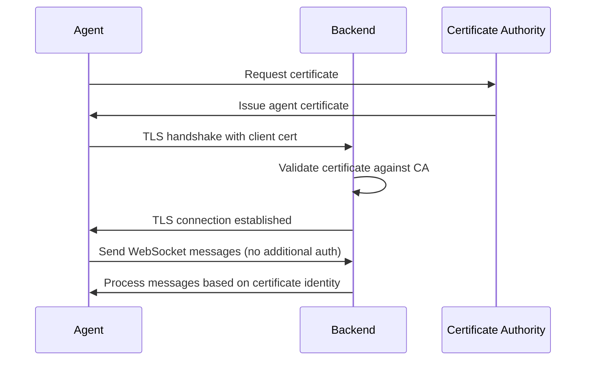

# Certificate-Based Authentication Analysis

## 🔐 **Authentication Approaches Comparison**

### **Current Approach: Ed25519 + Temporary Keys**
```go
// Current implementation
authPayload := map[string]interface{}{
    "agent_id":   wsm.agentID,
    "public_key": base64.StdEncoding.EncodeToString(wsm.publicKey),
    "timestamp":  time.Now().Unix(),
    "nonce":      wsm.generateNonce(),
}
```

**Pros:**
- ✅ Lightweight key exchange
- ✅ Works with current backend
- ✅ No certificate management needed

**Cons:**
- ❌ Complex key derivation
- ❌ Temporary keys for initial auth
- ❌ No built-in revocation
- ❌ Harder to manage at scale
- ❌ Custom authentication protocol

### **Recommended Approach: X.509 Certificates**
```go
// Certificate-based implementation
tlsConfig := &tls.Config{
    Certificates: []tls.Certificate{agentCert},
    RootCAs:      caCertPool,
    ServerName:   "aegis-backend",
    MinVersion:   tls.VersionTLS12,
}
```

**Pros:**
- ✅ Industry standard (TLS/mTLS)
- ✅ Built-in validation and revocation
- ✅ PKI integration
- ✅ Simpler agent implementation
- ✅ Better security model
- ✅ Easy certificate rotation
- ✅ Standard tooling support

**Cons:**
- ❌ Requires certificate management
- ❌ Backend needs to support mTLS
- ❌ Initial setup complexity

## 🏗️ **Implementation Architecture**

### **Certificate-Based WebSocket Flow**



### **Key Components**

1. **CertAuthManager**: Handles certificate loading and validation
2. **CertWebSocketManager**: WebSocket connection with mTLS
3. **Certificate Management**: CA, agent certificates, key rotation

## 📋 **Backend Requirements for Certificate Auth**

### **1. TLS/mTLS Support**
```go
// Backend needs to support client certificate validation
tlsConfig := &tls.Config{
    ClientAuth: tls.RequireAndVerifyClientCert,
    ClientCAs:  caCertPool,
}
```

### **2. Certificate Validation**
- Validate agent certificates against CA
- Check certificate expiration
- Implement certificate revocation (CRL/OCSP)
- Extract agent ID from certificate subject

### **3. Agent Identity Mapping**
```go
// Extract agent ID from certificate
func getAgentIDFromCert(cert *x509.Certificate) string {
    return cert.Subject.CommonName
}
```

## 🚀 **Migration Strategy**

### **Phase 1: Dual Support**
- Keep current Ed25519 auth for existing agents
- Add certificate auth for new agents
- Backend supports both authentication methods

### **Phase 2: Certificate Rollout**
- Generate certificates for existing agents
- Deploy certificate-based agents
- Monitor and validate

### **Phase 3: Ed25519 Deprecation**
- Remove Ed25519 authentication
- Full certificate-based system

## 🛠️ **Certificate Management**

### **Certificate Generation**
```bash
# Generate CA certificate
openssl genrsa -out ca-key.pem 2048
openssl req -new -x509 -key ca-key.pem -out ca-cert.pem -days 365

# Generate agent certificate
openssl genrsa -out agent-key.pem 2048
openssl req -new -key agent-key.pem -out agent.csr
openssl x509 -req -in agent.csr -CA ca-cert.pem -CAkey ca-key.pem -out agent-cert.pem -days 365
```

### **Agent Configuration**
```yaml
# agent-config.yaml
certificates:
  agent_cert: "/etc/aegis/agent-cert.pem"
  agent_key: "/etc/aegis/agent-key.pem"
  ca_cert: "/etc/aegis/ca-cert.pem"
  server_name: "aegis-backend"
```

## 📊 **Security Comparison**

| Feature | Ed25519 + Temp Keys | X.509 Certificates |
|---------|-------------------|-------------------|
| **Authentication** | Custom protocol | Standard TLS/mTLS |
| **Key Management** | Manual | PKI infrastructure |
| **Revocation** | Custom implementation | Built-in (CRL/OCSP) |
| **Rotation** | Complex | Standard procedures |
| **Validation** | Custom code | Standard libraries |
| **Audit Trail** | Custom logging | Standard PKI tools |
| **Compliance** | Custom | Industry standard |

## 🎯 **Recommendation**

**Use Certificate-Based Authentication** for the following reasons:

1. **Industry Standard**: TLS/mTLS is the gold standard for secure communication
2. **Better Security**: Built-in validation, revocation, and key management
3. **Easier Management**: Standard PKI tools and procedures
4. **Future-Proof**: Compatible with enterprise security requirements
5. **Simpler Code**: Less custom authentication logic

## 🔧 **Next Steps**

1. **Backend Team**: Implement mTLS support in WebSocket gateway
2. **Agent Team**: Implement certificate-based WebSocket manager
3. **Ops Team**: Set up certificate management infrastructure
4. **Testing**: Validate both authentication methods work together

## 📝 **Implementation Files Created**

- `cert_auth.go`: Certificate authentication manager
- `cert_websocket_manager.go`: Certificate-based WebSocket manager
- `test-cert-websocket.go`: Test program for certificate auth
- `CERTIFICATE_AUTHENTICATION_ANALYSIS.md`: This analysis document

The certificate-based approach provides a more robust, scalable, and maintainable solution for agent authentication! 🚀
